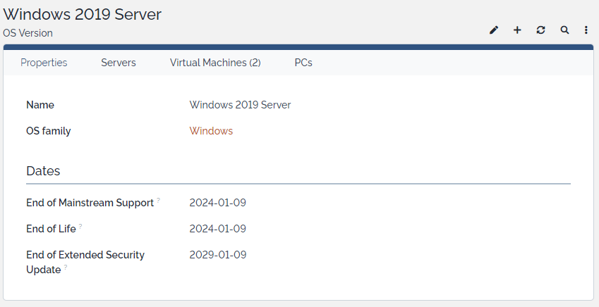
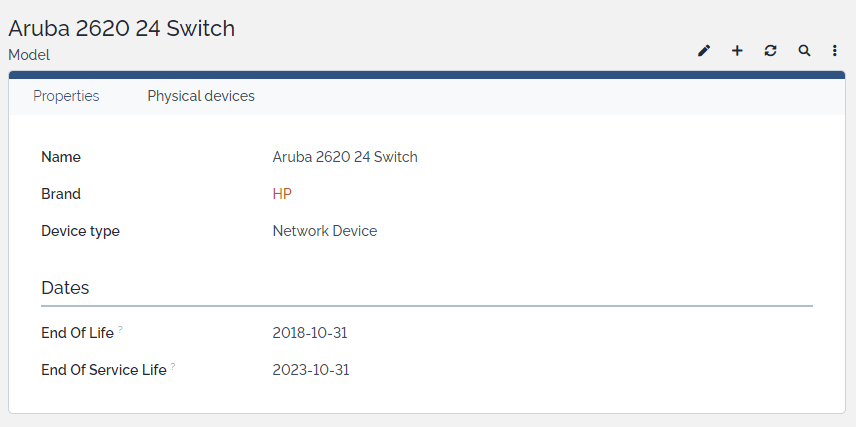
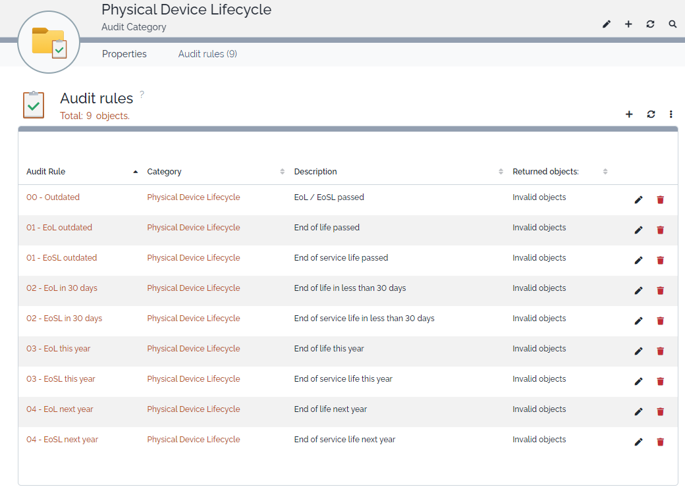

# iTop-br-lifecycle

Copyright (c) 2023-2024 Björn Rudner

## What?

Life Cycle Management of Devices, Brands, OS, etc.

## How?

### Class: OS Version

* End of Mainstream Support (EoMSS)
* End of Extended Support / End of Life (EoL)
* End of Extended Security Update (EoESU)

#### Screenshot OS Version

### Class: Model

* End Of Life (EoL)
* End Of Service Life (EoSL)

#### Screenshot Model

### Audit rules

Adds audit rules for lifecycle management:

* Physical Devices
  * EoL/EoSL passed
  * EoL/EoSL within 30 days
  * EoL/EoSL this year
  * EoL/EoSL next year

#### Screenshot Audit Rules

## iTop Compatibility

The branch [2.7](https://github.com/rudnerbjoern/iTop-br-lifecycle/tree/itop/2.7) is compatible to iTop 2.7 and iTop 3.1.

The branch [main](https://github.com/rudnerbjoern/iTop-br-lifecycle/tree/main) will only be compatible to iTop 3.1.

Versions starting with 2.7.x are kept compatible to iTop 2.7

The extension was tested on iTop 2.7.10 and 3.1.1

## Attribution
